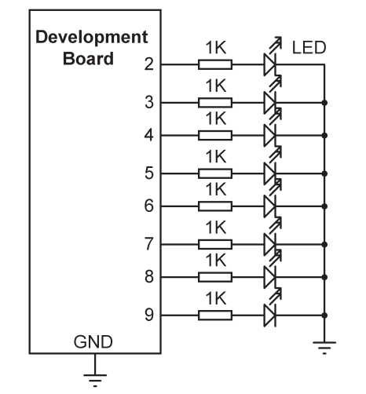

# Description: 
In this project, 8 LEDs are connected to the development board as in the 
previous project, the LEDs count up in binary with a 500-ms delay between each count.
 

# Code
```cpp
//----------------------------------------------------------------------
// BINARY COUNTING LEDs
// ====================
//
// In this program, 8 LEDs are connected, and they count up in binary
//
// Author: Muhammed Alessa
// File : LEDcount
// Date : June, 2023
//----------------------------------------------------------------------
#define ON HIGH // Define ON
#define OFF LOW // Define OFF
int LED[] = {9, 8, 7, 6, 5, 4, 3, 2}; // LEDs at ports 2 to 9
int Count = 0;
void setup() 
{
 for(int i = 0; i < 8; i++)
 {
 pinMode(LED[i], OUTPUT); // Configure LEDs as outputs
 }
 ALLOFF(); // All LEDs OFF
}
//
// Turn OFF all LEDs
//
void ALLOFF()
{
 for(int i = 0; i < 8; i++)
 digitalWrite(LED[i], OFF); // LEDs OFF at beginning
}
//
// Group the port pins together. L is the number of bits (8 here),and No
// is the data to be displayed
//
void Display(int No, int L)
{
 int i, m, j;
 
 m = L - 1;
 for(i = 0; i < L; i++)
 {
 j = 1;
 for(int k = 0; k < m; k++)j = j * 2;
 if((No & j) != 0)
 digitalWrite(LED[i], ON);
 else
 digitalWrite(LED[i], OFF);
 m--;
 }
}
```