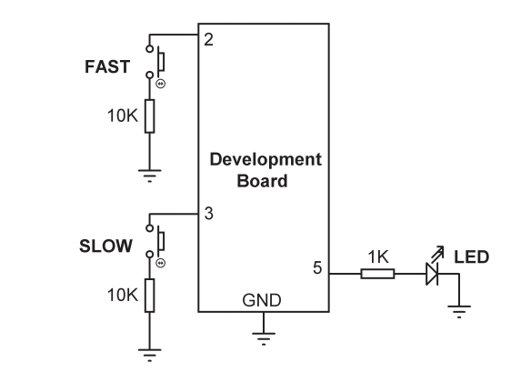

# Description:
In this project, two buttons named FAST and SLOW and an LED are used. 
Pressing FAST will increase the LED flashing rate. Similarly, pressing SLOW will decrease 
the LED flashing rate. This project aims to show how external interrupts can be used with the Arduino IDE.

---

 

# Code
```cpp
//----------------------------------------------------------------------
// CONTROLLING THE LED FLASHING RATE
// =================================
//
// In this program an LED and two buttons named FAST and SLOW are connected.
// Pressing FAST increases flashing rate.Pressing SLOW decreases flashing rate.
//
// The program is based on using external interrupts
//
// Modified software that uses software pull-up of input pin
//
// Author: Muhammed Alessa
// File : LEDcontrol
// Date : April, 2026
//----------------------------------------------------------------------
#define ON HIGH // Define ON
#define OFF LOW // Define OFF
uint8_t LED = 5; // LED at port5
uint8_t FAST = 2; // FAST button at port 2
uint8_t SLOW = 3; // SLOW button at port 3
int dely = 1000; // Default delay (1000 ms)
void setup() 
{
 pinMode(LED, OUTPUT); // Configure LED as output
 digitalWrite(LED, OFF); // LED OFF at beginning
 pinMode(FAST, INPUT_PULLUP); // Pull-up FAST button pin
 pinMode(SLOW, INPUT_PULLUP); // Pull-up SLOW button pin
 attachInterrupt(digitalPinToInterrupt(2), FAST_CODE, FALLING);
 attachInterrupt(digitalPinToInterrupt(3), SLOW_CODE, FALLING);
}
//
// FAST_CODE interrupt service routine
//
void FAST_CODE()
{
 dely = dely - 50; // Decrement delay
 if(dely < 0)dely = 0;
}
//
// SLOW_CODE interrupt service routine
//
void SLOW_CODE()
{
 dely = dely + 50; // Increment delay
}
void loop() 
{
 digitalWrite(LED, ON); // LED ON
 delay(dely); // Delay
 digitalWrite(LED, OFF); // LED OFF
 delay(dely); // Delay
}

```